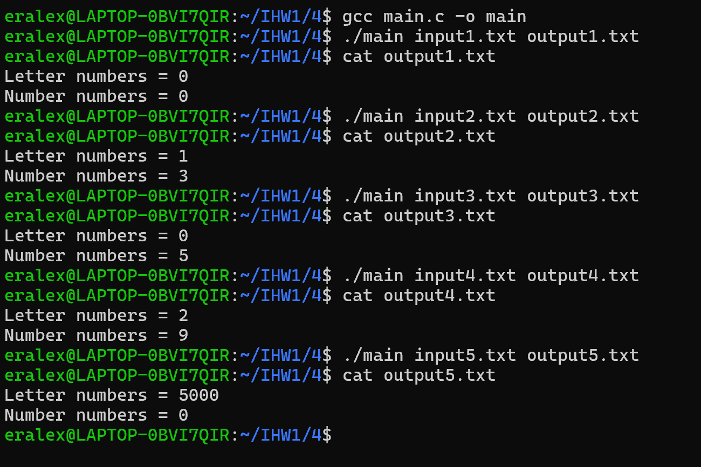
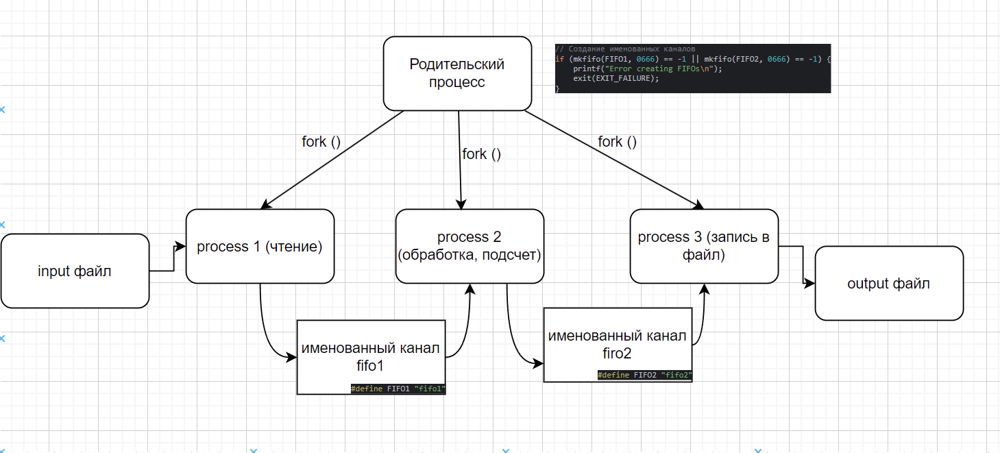
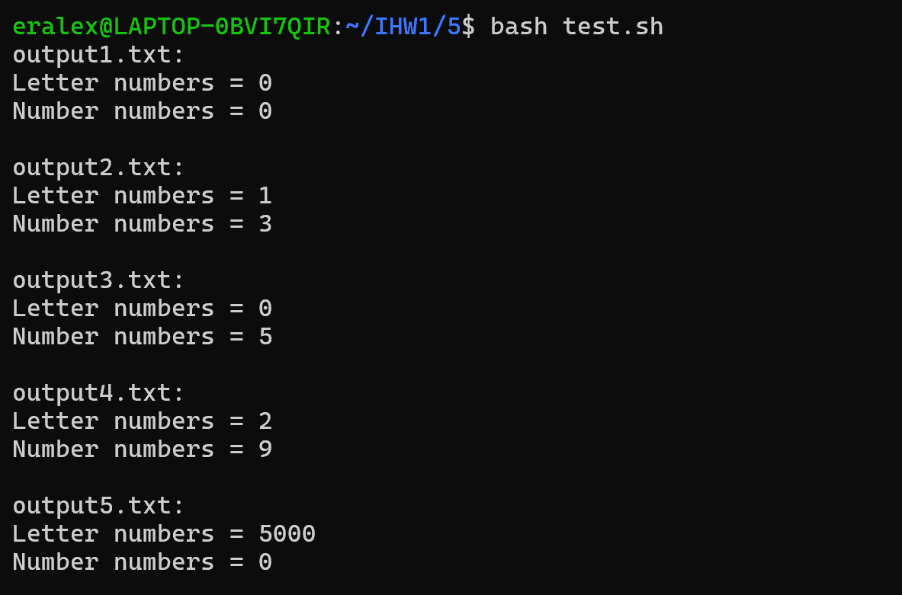
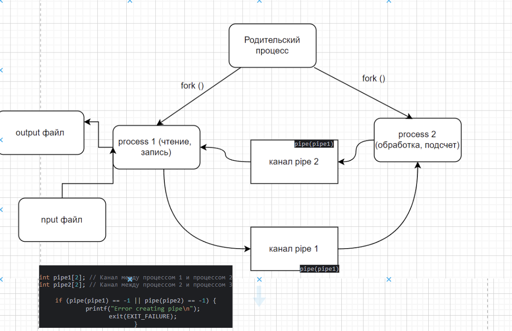
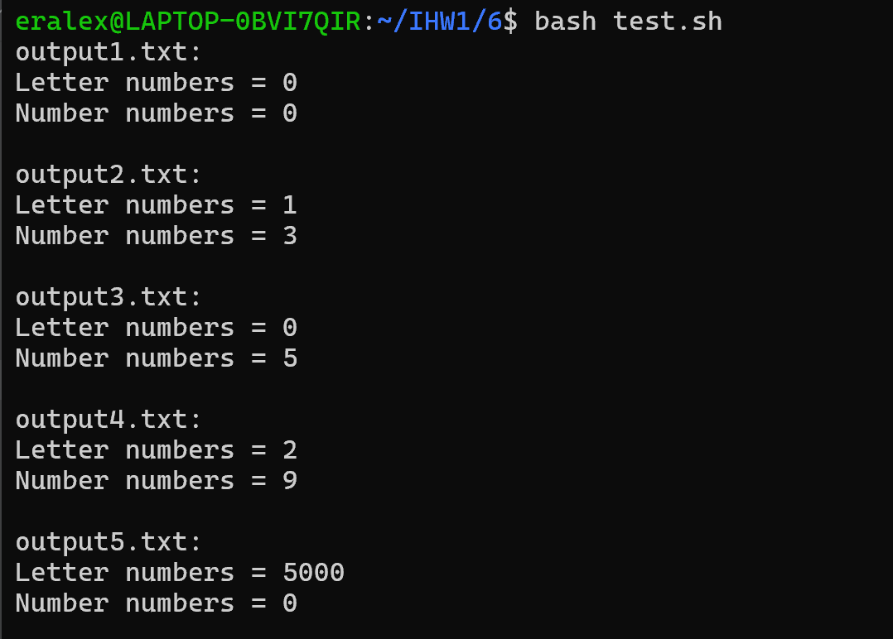
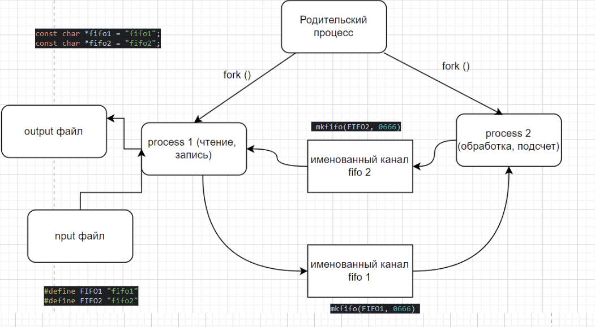
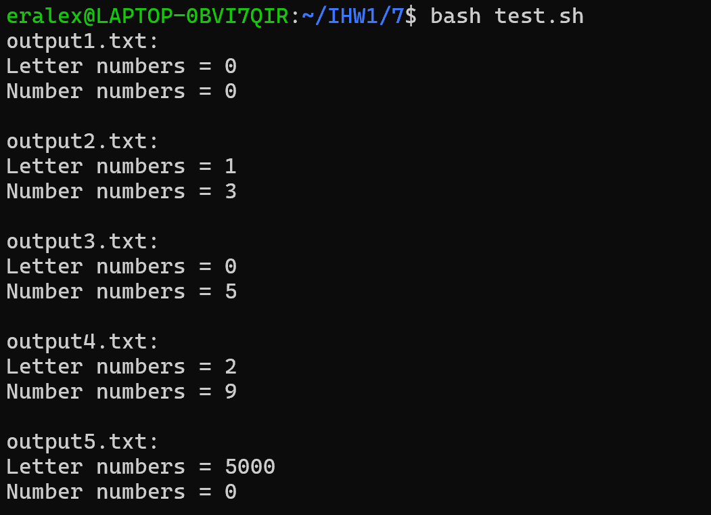
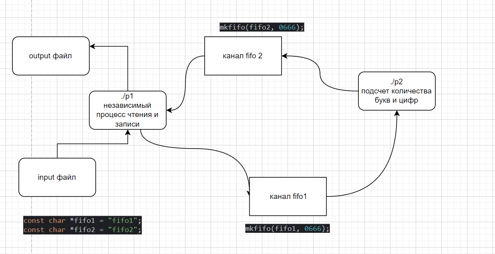
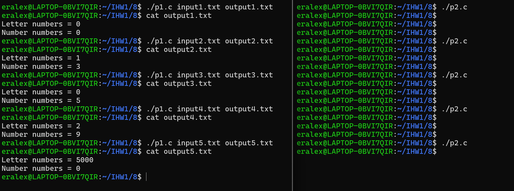
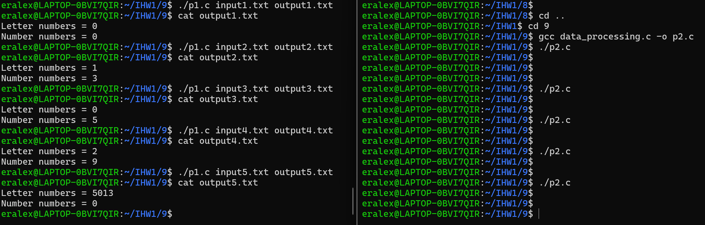

# Отчет

Вариант: 17
Имя: Ермолаева Елена Александровна
Группа: БПИ224

## Условие

Разработать программу, которая вычисляет количество цифр и
букв в заданной ASCII–строке. В формируемом выводе помимо
полученных чисел необходимо вывести информацию о том, какое 
число указывает на количество цифр, а какое на количество букв

## Тестирование:

Для всех заданий используются одинаковые входные файлы. 

intput1.txt -- пустой

input2.txt -- 1 строка

input3.txt -- несколько строк (только цифры)

input4.txt -- несколько строк

input5.txt -- большой файл (5000) (на оценку 9 он другой)

# Оценка 4



**Запуск:**

Формат командрой строки  `./main <input file> <outtput file>`

```
gcc main.c -o main
./main input1.txt output1.txt
```

### Схема

Родительский поток порождает 3 дочених процесса.
Дочерние процессы выполняют чтение из файла, обработка строки (подсчет букв и цифр), запись в файл соответсвенно.
Передача данных между процессами происходит через неименованные каналы pipe1, pipe2 как показано на схеме. 
Каналы создаются родительским процессом. 

### Выходные файлы

Их содержимое после запуска программы представлено на скриншоте


# Оценка 5


Формат командрой строки  `./main <input file> <outtput file>`

### Схема

Родительский поток порождает 3 дочених процесса.
Дочерние процессы выполняют чтение из файла, обработка строки (подсчет букв и цифр), запись в файл соответсвенно.
Передача данных между процессами происходит через именованные каналы fifo1, fifo2 как показано на схеме.
Каналы создаются родительским процессом.



## Запуск 

Для упрощения тестирования создан `test.sh` запускающий все 5 тестов

```
bash test.sh
```


### Выходные файлы

Их содержимое после запуска программы представлено на скриншоте





# Оценка 6

Формат командрой строки  `./main <input file> <outtput file>`


Для запуска:
```
bash test.sh
```

### Схема



Родительский поток порождает 2 дочених процесса `pid1`, `pid2`.
Дочерние процессы выполняют чтение, запись файла; обработка строки (подсчет букв и цифр) соответсвенно.
Передача данных между процессами происходит через каналы pipe1, pipe2 как показано на схеме.
Каналы создаются родительским процессом.


Процесс pid1 записывает данные в канал pipe1 для передачи данных в pid2, и ожидает завершения pid2.
Процесс pid2 принимает данные из pipe1, обрабатывает строку и  записывает результаты в канал pipe2, чтобы передать данные обратно в pid1.
Процесс pid1 принимает данные из pipe2 и производит запись в файл.

### Выходные файлы

Их содержимое после запуска программы представлено на скриншоте




# Оценка 7

Формат командрой строки  `./main <input file> <outtput file>`

Для запуска:
```
bash test.sh
```
### Схема 



Аналогично оценке 6, только используются именованные каналы

### Выходные файлы

Их содержимое после запуска программы представлено на скриншоте




# Оценка 8

Формат командрой строки для rw_process  `./main <input file> <outtput file>`

Формат командрой строки  data_processing `./main`

### Схема


### Выходные файлы

Их содержимое после запуска программы представлено на скриншоте




# Оценка 9


### Выходные файлы

Их содержимое после запуска программы представлено на скриншоте

! важно учесть, что при тестировании большого файла
output5.txt не совпадает с файлами из предыдущих тестов и содержит большее кол-во букв 

